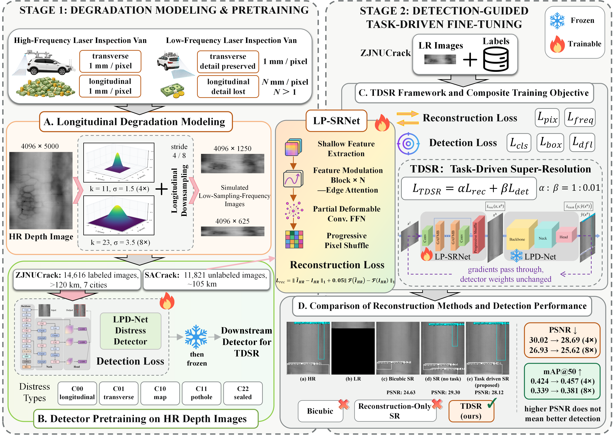
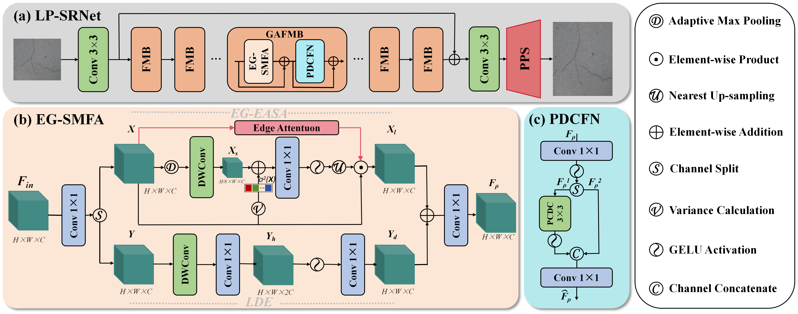
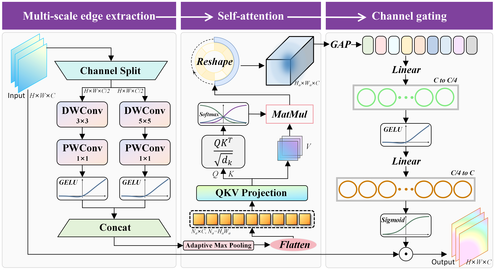
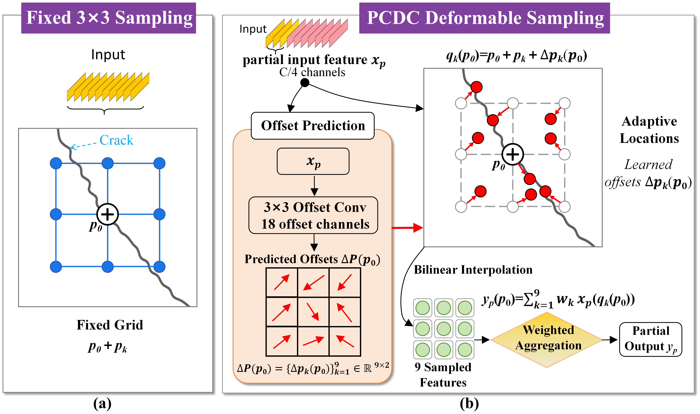
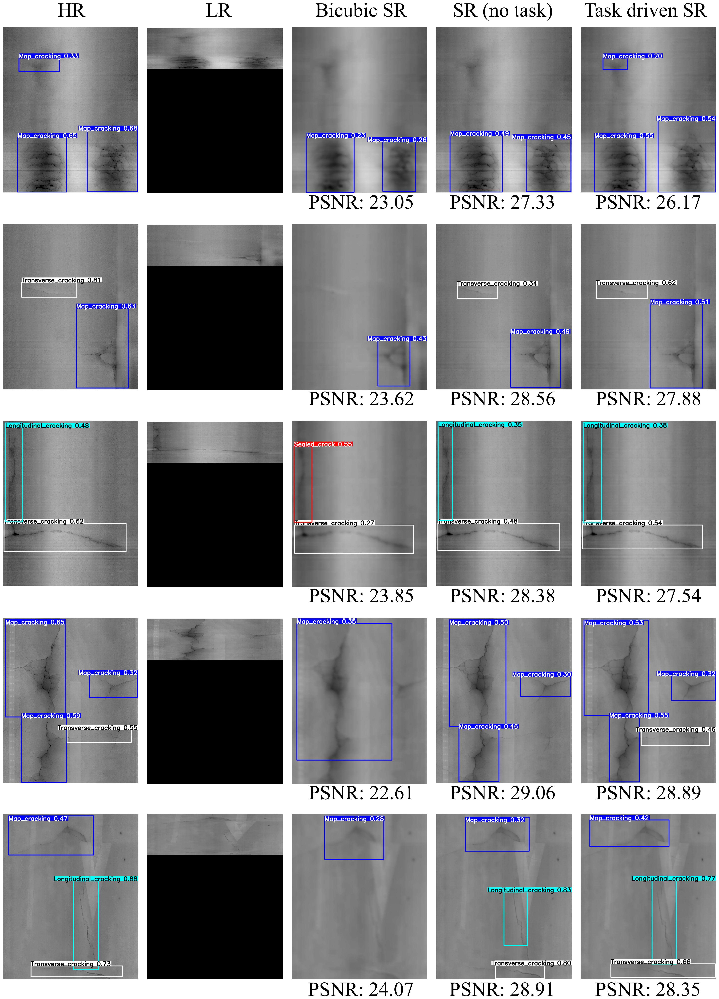

# Task-Driven Anisotropic Super-Resolution of 3D Pavement Depth Images for Distress Detection

Official code of **LP-SRNet** for longitudinally undersampled 3D laser depth images. Task-driven super-resolution (TDSR) is the training procedure used with this network.

> Yi Liang, Wenjing Yang, Shaowei Yan, Junqing Zhu, Jirui Li, and Xiwen Yang  
> School of Transportation, Southeast University  
> The Visual Computer

Low-frequency line-structured-light inspection keeps the transverse profile and loses samples along the direction of travel. This repository restores that longitudinal axis at **4×** and **8×**, then fine-tunes the reconstruction network with a frozen distress detector.

LP-SRNet keeps the eight-block SMFANet backbone. One intermediate block is replaced by a geometry-aware feature modulation block (GAFMB) with edge attention and a partial deformable convolution feed-forward network. Reconstruction uses two successive 2× longitudinal pixel-shuffle stages at 4×, and three stages at 8×. Each stage is a depthwise 3×3 refinement followed by a pointwise subpixel projection. Width is never resampled.

<p align="center">
  <br>
  <em>Fig. 1. Overall workflow of the task-driven super-resolution (TDSR) detection framework.</em>
</p>

<p align="center">
  <br>
  <em>Fig. 2. Architecture of LP-SRNet. (a) Seven feature modulation blocks, one GAFMB, and progressive longitudinal pixel shuffle. (b) Edge-guided self-modulation. (c) Partial deformable convolution feed-forward network.</em>
</p>

<p align="center">
  <br>
  <em>Fig. 3. Edge attention: multi-scale depthwise extraction, pooled self-attention, and channel gating.</em>
</p>

<p align="center">
  <br>
  <em>Fig. 4. Fixed 3×3 sampling and partial-channel deformable sampling. Only one quarter of the channels predict offsets.</em>
</p>

## Installation

```bash
conda create --name tdsr python=3.8
conda activate tdsr
pip install -r requirements.txt
python setup.py develop
```

Task-driven fine-tuning and mAP evaluation also need the frozen LPD-Net checkpoint through Ultralytics:

```bash
pip install ultralytics
```

Reconstruction pretraining does not need it. Tested software stack in the article: Ubuntu 22.04, PyTorch, and an NVIDIA GeForce RTX 4090.

## Data

SACrack (11,821 unlabeled images, about 105 km) is the reconstruction pretraining set. ZJNUCrack (14,616 labeled images, more than 120 km) is the fine-tuning and evaluation set. The five classes follow JTG 5210-2018:

| id | code | distress |
|----|------|----------|
| 0 | C00 | longitudinal cracking |
| 1 | C01 | transverse cracking |
| 2 | C10 | map cracking |
| 3 | C11 | pothole |
| 4 | C22 | sealed cracking |

Split whole acquisition segments about 7:2:1 before making low-resolution copies, so every degraded copy of an image stays in one split. Labels are YOLO text files normalized to the high-resolution image. See [datasets/README.md](datasets/README.md) for the directory layout.

The depth images are shared on Baidu Netdisk. The shared file is **Def**.

链接: https://pan.baidu.com/s/1NNIJG4tMBOV0SpUeH5Vd-A?pwd=abcd  
提取码: `abcd`

Images use **height as the travel direction** and **width as the transverse profile**. The article's 4,096×5,000 transverse-by-longitudinal frame is stored as shape `(5000, 4096)`.

### Longitudinal degradation

Scale 4 uses an 11-tap Gaussian with σ = 1.5 and keeps every 4th profile, producing 4,096×1,250. Scale 8 uses a 23-tap Gaussian with σ = 3.5 and keeps every 8th profile, producing 4,096×625. Padding is reflection. No transverse resampling, noise, or compression is added. Outputs are rounded, clipped, and saved as 8-bit depth.

```bash
python scripts/degrade_longitudinal.py --hr-dir datasets/SACrack/train/HR --out-dir datasets/SACrack/train/LR/x4 --scale 4
python scripts/degrade_longitudinal.py --hr-dir datasets/SACrack/train/HR --out-dir datasets/SACrack/train/LR/x8 --scale 8
```

Run the same commands for the validation and test splits, and for ZJNUCrack. Pass `--longitudinal-axis width` only when the raw file stores travel along its width; the saved arrays are transposed into the height convention above.

## Training

The configs below are the longitudinal models. Older `SMFANet_*` option files still train the original isotropic SMFANet and do not implement this article.

The reconstruction loss is L1 plus 0.05 times the L1 distance between real 2-D Fourier transforms. Pretraining uses Adam at `1e-3`, cosine annealing to `1e-6`, batch size 4, and EMA 0.999. The article does not give the pretraining iteration count or the HR crop; the configs use 300,000 iterations and 256×256 crops. Rotation is disabled so the longitudinal axis stays vertical. Change `total_iter` and `scheduler.periods` together if you use another budget.

```bash
python basicsr/train.py -opt options/train/LPSRNet_SACrack_x4.yml
python basicsr/train.py -opt options/train/LPSRNet_SACrack_x8.yml
```

Target-domain reconstruction fine-tuning uses Adam at `1e-4`, dropped by 10× every 200,000 iterations. `total_iter: 200000` is SR-FT. `total_iter: 600000` is SR-FT+.

```bash
python basicsr/train.py -opt options/train/LPSRNet_ZJNUCrack_FT_x4.yml
python basicsr/train.py -opt options/train/LPSRNet_ZJNUCrack_FT_x8.yml
```

### Task-driven fine-tuning

Set `path.pretrain_network_det` to the frozen LPD-Net weights. Detection gradients pass through the detector and update only LP-SRNet. The detection term uses the article's coefficients:

```text
L_det = 7.5 L_cls + 0.5 L_box + 1.5 L_dfl
L = alpha L_rec + beta L_det
```

The released schedule is TDSR-0.01: 200,000 reconstruction iterations, then 400,000 iterations at α:β = 1:0.01.

```bash
python basicsr/train.py -opt options/train/TDSR_ZJNUCrack_x4.yml
python basicsr/train.py -opt options/train/TDSR_ZJNUCrack_x8.yml
```

Edit `train.loss_schedule` for the other reported settings:

| setting | schedule |
|---------|----------|
| TDSR-0.1 | 200k at 1:0, then 400k at 1:0.1 |
| TDSR-0.01 | 200k at 1:0, then 400k at 1:0.01 |
| TDSR-DET | 600k at 0:1 |
| TDSR-Grad | 200k at 1:0, 140k at 1:0.01, 140k at 1:0.1, 120k at 1:1 |

`detector_opt.imgsz` is the letterbox size seen by the frozen detector. Set it to the resolution used to train LPD-Net. Single-channel depth is repeated to three channels when the detector's first convolution expects RGB.

### Component ablation

`network_g` switches the three added parts. The longitudinal SMFANet baseline is the same network with all three off, so the comparison still upsamples height only.

| model | `use_ea` | `use_pdcfn` | `use_pps` |
|-------|----------|-------------|-----------|
| SMFANet baseline | false | false | false |
| + edge attention | true | false | false |
| + PDCFN | true | true | false |
| LP-SRNet | true | true | true |

The GAFMB replaces block index 3. `use_pps: false` uses one longitudinal pixel-shuffle of 4× or 8× instead of successive 2× stages.

## Testing

Pretraining saves `params` and `params_ema`. Load `params_ema` from those checkpoints. Fine-tuning turns EMA off, so load `params` from a fine-tuned checkpoint.

```bash
python basicsr/test.py -opt options/test/LPSRNet_x4.yml
python basicsr/test.py -opt options/test/LPSRNet_x8.yml
```

Full 4,096×5,000 frames are reconstructed in tiles (`tile_size` is low-resolution height and width). PSNR and SSIM are computed on the depth channel.

```bash
python scripts/eval_detection.py --weights experiments/TDSR_ZJNUCrack_x4/models/net_g_latest.pth --lq-dir datasets/ZJNUCrack/test/LR/x4 --gt-dir datasets/ZJNUCrack/test/HR --label-dir datasets/ZJNUCrack/test/labels --scale 4 --detector /path/to/lpdnet.pt
```

For a direct detector run on low-resolution images, divide the longitudinal box center and box height by the scale and leave the transverse center and width unchanged. After LP-SRNet, use the original HR boxes.

`python scripts/check_lpsrnet.py` checks 4× and 8× output shapes, backward through the deformable block, and the degradation sizes 5,000 → 1,250 and 5,000 → 625. It also prints the parameter count of this implementation. The article reports 188/192 K for LP-SRNet and 182/187 K for the baseline at 4×/8×.

## Results reported in the article

On SACrack, LP-SRNet improves PSNR/SSIM over the longitudinal SMFANet baseline by 0.60 dB / 0.0134 at 4× (31.20 dB / 0.8205) and by 0.46 dB / 0.0131 at 8× (29.23 dB / 0.7926).

On ZJNUCrack, detector-guided TDSR-0.01 is the strongest detection setting. Relative to the best reconstruction-only fine-tune (SR-FT+), mAP@50 rises from 0.424 to 0.457 at 4× and from 0.339 to 0.381 at 8×. PSNR falls by 1.33 dB and 1.31 dB. Detection on the original HR images is 0.506 mAP@50. The same frozen detector and inference settings are used for every reconstruction.

<p align="center">
  <br>
  <em>Fig. 5. Qualitative comparison under 4× longitudinal degradation. Every box comes from the same frozen detector. PSNR is in decibels.</em>
</p>

## Citation

```bibtex
@article{liang2026tdsr,
  title={Task-Driven Anisotropic Super-Resolution of 3D Pavement Depth Images for Distress Detection},
  author={Liang, Yi and Yang, Wenjing and Yan, Shaowei and Zhu, Junqing and Li, Jirui and Yang, Xiwen},
  journal={The Visual Computer},
  year={2026}
}
```

The frozen detector is LPD-Net from Liang et al., Engineering Applications of Artificial Intelligence, 2026, 167:113876.

## Acknowledgements

This work benefits from the open-source SMFANet project: https://github.com/Zheng-MJ/SMFANet

The training toolbox also comes from BasicSR: https://github.com/XPixelGroup/BasicSR. Training commands still use the `basicsr` package layout.

## Contact

Yi Liang, School of Transportation, Southeast University: [230260401@seu.edu.cn](mailto:230260401@seu.edu.cn)
